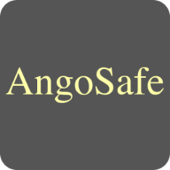

***Uma API navegável para Segurança e Encriptação de Dados e foi criada com o intuito de transformar informações em formato ilegível para proteger a sua confidencialidade.***

## Introdução

O processo criptográfico baseia-se na construção de algoritmos matemáticos que transformam os dados em um formato ilegível, com uso de chaves para criptografar e descriptografar o conteudo.

O **AngoSafe** é um projecto software de criptografia, desenvolvido por uma equipa de programadores angolanos.

E tem como maior função, garantir a Segurança e Privacidade dos dados dos usuarios, protegendo informações confidenciais contra hackers e outras ameaças cibernéticas.

## Como Funciona

O **AngoSafe** utiliza um algoritmo avançado de criptografia para proteger as informações dos usuarios, tornando-as praticamente impossiveis de serem decifradas sem a chave e sequência correcta.

Além disso o software é fácil de ser usado e pode ser instalado ou configurado em diversos dispositivos.

Tendo usado um algoritmo de criptografia particular e dinâmico, entitulado [**GCrypter**](/).

O **GCrypter** é um "algoritmo/software" de criptografia também desenvolvido por um jovem angolano **"Nurul-GC"**, que já é amplamente utilizado pois oferece recursos avançados de proteção de dados.

Ele permite que os usuarios criptografem mensagens, arquivos e outros dados, garantindo assim a Segurança e a Confidencialidade das informações.

## Aplicações

Com o crescente número de ataques cibernéticos em todo mundo, a necessidade de proteger as informações pessoais e profissionais nunca foi tão importante. O **AngoSafe** surge como uma solução eficaz para garantir a Segurança e Privacidade dos dados dos usuarios em Angola e além das suas fronteiras.

Uma das principais caracteristicas do programa é a sua interface intuitiva e fácil de usar, seja pela [WebAPI](/) ou pelo [Desktop](/), o que torna o processo de criptografia acessível mesmo para usuarios menos experientes.

Além da dinámica e eficacia na segurança de comunicações, isto é, garantindo a proteção de dados durante o envio e recebimento de mensagens online e também preservando a confidencialidade das transações financeiras, o software suporta uma variedade de algoritmos de criptografia robustos, como `AES (Advanced Encryption Standard)`, `RSA (Rivest-Shamir-Adleman)` e um algoritmo particular baseado na coorelação do valor binário entre uma `'string (palavra/frase)'` e um `'número inteiro'` retornando dois tokens (sequência númerica) encriptados de forma dinâmica.

Salvo o dinamismo e eficácia do algoritmo, o algoritmo não necessita de uma chave particular extra de criptografia, permitindo ao usuario encriptar as suas informações sem se preocupar com a perda ou corrupção dos dados.

## Importância

Sendo a criptografia, a prática de transformar informações sensíveis em formatos ilegíveis para proteger a sua confidencialidade.

E sendo amplamente usada para garantir a segurança de dados em comunicações, transações online e armazenamento de informações sensíveis.

A sua importância reside maioritariamente em manter a privacidade e evitar acessos não autorizados a esses conteúdos.

---

© 2023 3MGC - [Licenciado sob a Licença "Impulsionando o Desenvolvimento de Software (3a Claúsula) | BSD 3-Clause"](LICENSE)
